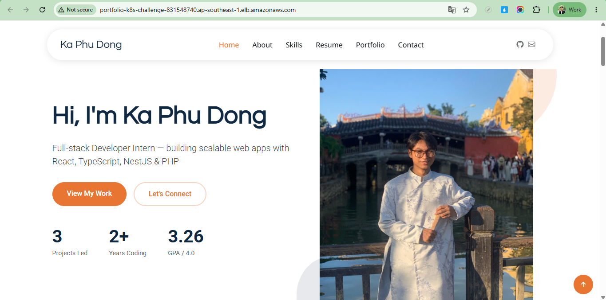
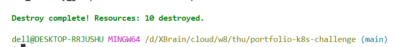

# Portfolio K8s Challenge — Kubernetes on AWS · Terraform 1-Click

> **Mục tiêu challenge:** Dựng EC2, chạy minikube bên trong, deploy app vào Kubernetes, expose ra Internet qua ALB — toàn bộ bằng 1 lệnh Terraform. Phải dùng ≥2 provider, app phải chạy *trong* K8s (không cài thẳng lên EC2).

---

## Kiến trúc

```
Internet
  │
  ▼
AWS ALB :80  (Security Group: chỉ cho HTTP vào)
  │
  ▼
Target Group → EC2 Ubuntu 22.04 (t3.small) :30080
  │
  └─ Docker
      └─ minikube --driver=docker --ports=30080:30080
          ├─ Deployment: portfolio  (3 replica · nginx · image: xbrain-portfolio:latest)
          └─ Service: NodePort 30080  ──────────────────────────────►  ALB Target
```

**Luồng traffic:**  
`Browser → ALB :80 → Target Group → EC2 :30080 → K8s NodePort → Pod nginx`

---

## Providers (≥2 — yêu cầu bắt buộc)

| Provider | Version | Vai trò |
|---|---|---|
| `hashicorp/aws` | `~> 5.0` | EC2, SG, ALB, TG, Listener, Key Pair |
| `hashicorp/tls` | `~> 4.0` | Tự generate RSA 4096 SSH key pair |
| `hashicorp/local` | `~> 2.5` | Ghi private key ra file `.pem` local |
| `hashicorp/http` | `~> 3.5` | Tự lấy public IP hiện tại để mở SSH `/32` |

> **Wire provider:** `http` lấy public IP operator → EC2 Security Group SSH rule; `tls_private_key` → `aws_key_pair` (public key) + `local_file` (private key `.pem`). Các provider phối hợp trong một `terraform apply` duy nhất — không cần script ngoài.

---

## Cấu trúc thư mục

```
portfolio-k8s-challenge/
├── main.tf                  # toàn bộ infra + provisioner
├── variables.tf
├── outputs.tf
├── terraform.tfvars
├── frontend/                # source code app (HTML/CSS/JS)
├── k8s-manifests/
│   ├── deployment.yaml      # 3 replica, readiness + liveness probe
│   └── service.yaml         # NodePort 30080
└── imgs/
    ├── website.png          # bằng chứng app chạy qua ALB
    └── destroy.png          # bằng chứng destroy sạch
```

---

## Cách app được đưa vào K8s (không cài thẳng EC2)

```
Terraform
  │
  ├─ provisioner "file"      → copy frontend/ lên EC2
  ├─ provisioner "remote-exec"
  │    ├─ docker build -t xbrain-portfolio:latest ./frontend
  │    ├─ minikube image load xbrain-portfolio:latest   ← load vào minikube registry
  │    ├─ kubectl apply -f k8s-manifests/               ← Deployment + Service
  │    └─ kubectl rollout status deployment/portfolio   ← đợi 3 Pod sẵn sàng
  └─ aws_lb_target_group_attachment                     → wire EC2 vào ALB
```

`imagePullPolicy: Never` — K8s chỉ tìm image trong registry local của minikube, không pull Docker Hub.

---

## Kubernetes Manifests

**Deployment** (`k8s-manifests/deployment.yaml`)
- `replicas: 3` — 3 Pod nginx
- `readinessProbe`: HTTP GET `/` :80, `initialDelaySeconds: 5`, `periodSeconds: 5`
- `livenessProbe`: HTTP GET `/` :80, `initialDelaySeconds: 15`, `periodSeconds: 10`
- Rolling update mặc định — zero downtime khi update image

**Service** (`k8s-manifests/service.yaml`)
- `type: NodePort`, `nodePort: 30080`
- `selector: app=portfolio` — tự tìm đúng 3 Pod

---

## Chạy (1-click)

**Yêu cầu:** AWS CLI đã cấu hình (`aws configure`), Terraform ≥ 1.6, kết nối Internet.

```powershell
# Bước 1 — clone về, vào thư mục
cd cloud\w8\thu\portfolio-k8s-challenge

# Bước 2 — init provider
terraform init

# Bước 3 — 1 lệnh dựng toàn bộ
terraform apply
# nhập "yes" khi được hỏi
# ~8-12 phút (apt install + minikube start + image build)
```

Sau khi apply xong:

```powershell
# Lấy URL ALB
terraform output -raw alb_url

# SSH debug nếu cần
terraform output -raw ssh_command
```

---

## Biến cấu hình

| Biến | Default | Mô tả |
|---|---|---|
| `aws_region` | `ap-southeast-1` | Region deploy |
| `instance_type` | `t3.small` | EC2 size |
| `node_port` | `30080` | K8s NodePort (30000–32767) |
| `minikube_memory_mb` | `1800` | RAM cấp cho minikube (MB) |
| `ssh_allowed_cidr` | `""` | CIDR được phép SSH vào EC2. Để trống thì Terraform tự lấy public IP hiện tại và thêm `/32` |

`terraform.tfvars` có thể chỉ cần các giá trị lab cơ bản:

```hcl
aws_region         = "ap-southeast-1"
instance_type      = "t3.small"
node_port          = 30080
minikube_memory_mb = 1800
```

Không cần sửa `ssh_allowed_cidr` khi clone repo về. Terraform gọi `https://api.ipify.org`, lấy IP public của máy đang chạy lệnh, rồi dùng giá trị đó cho rule SSH dạng `YOUR_PUBLIC_IP/32`. Nếu muốn override thủ công, vẫn có thể thêm `ssh_allowed_cidr = "x.x.x.x/32"` vào `terraform.tfvars`.

---

## Outputs

| Output | Mô tả |
|---|---|
| `alb_url` | URL app — mở trên browser |
| `alb_dns_name` | DNS name của ALB |
| `ec2_public_ip` | IP public của EC2 |
| `ssh_command` | Lệnh SSH để debug |
| `ssh_private_key_path` | Đường dẫn file `.pem` được tạo tự động |

---

## Bằng chứng

**App chạy qua ALB:**



**Destroy sạch:**



---

## Acceptance Checklist

| # | Tiêu chí | Đạt |
|---|---|---|
| 1 | 1 lệnh từ repo sạch → app chạy, ALB URL trả về trang app | ✅ |
| 2 | App chạy trong K8s (Deployment + Pod), không cài thẳng EC2 | ✅ |
| 3 | ≥2 provider wire trong cùng cấu hình (`aws` + `tls` + `local` + `http`) | ✅ |
| 4 | Reproducible — dựng lại từ đầu cho kết quả như nhau | ✅ |
| 5 | Dọn sạch bằng `terraform destroy` | ✅ |

---

## Dọn dẹp

```powershell
terraform destroy
# nhập "yes"
# Xóa: ALB, Target Group, SG, EC2, Key Pair, file .pem local
```

> ⚠️ Chạy destroy ngay sau khi demo xong để tránh tốn tiền AWS.

---

## Thiết kế — Vì sao chọn cách này?

- **minikube `--driver=docker`** — không cần VM driver, chạy được trên EC2 bare metal Ubuntu, không tốn thêm RAM cho hypervisor.
- **`--ports=30080:30080`** — map cổng NodePort ra host EC2, ALB target group nhắm thẳng vào port này mà không cần Ingress Controller.
- **ALB thay vì NodePort trực tiếp** — EC2 SG chặn port 30080 từ Internet, chỉ ALB SG mới được vào → tăng bảo mật, có health check tự động.
- **`tls` provider** — tự gen key, không cần lưu private key vào repo, không cần tạo tay trên AWS console.
- **`http` provider** — tự phát hiện public IP hiện tại để mở SSH đúng `/32`, giúp người clone repo không cần sửa `ssh_allowed_cidr`.
- **`imagePullPolicy: Never`** — tránh phụ thuộc Docker Hub, build local là đủ, phù hợp lab offline.
